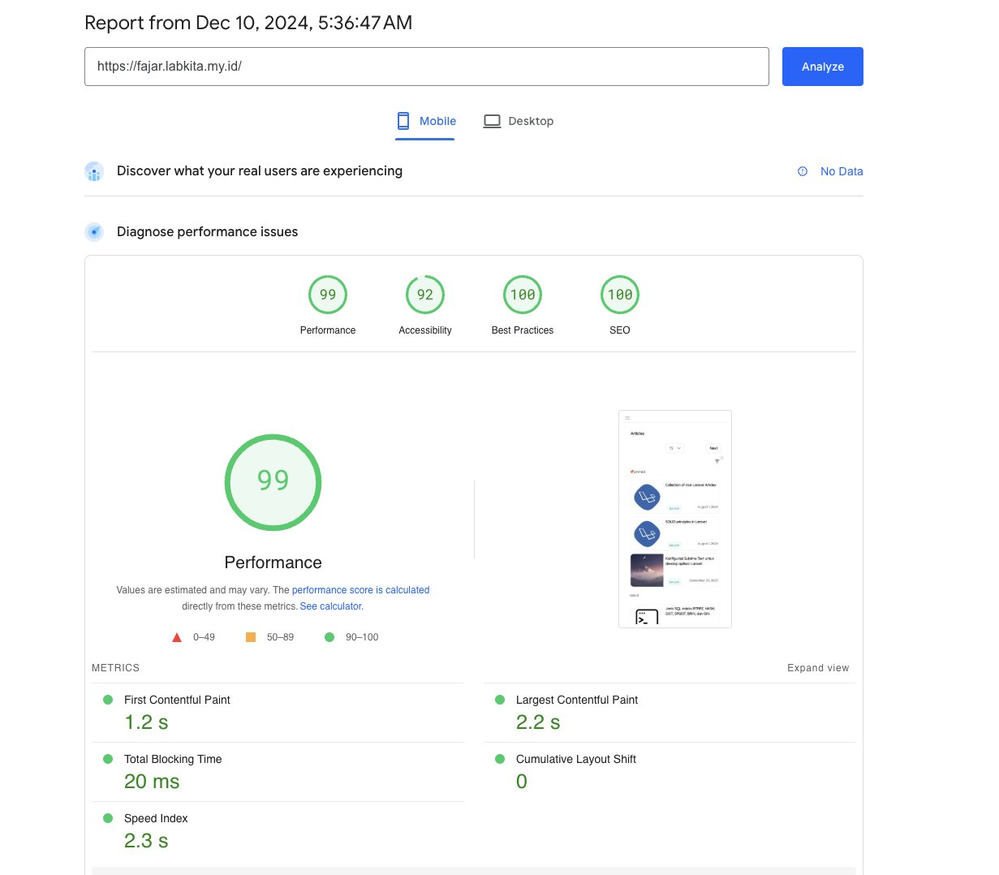
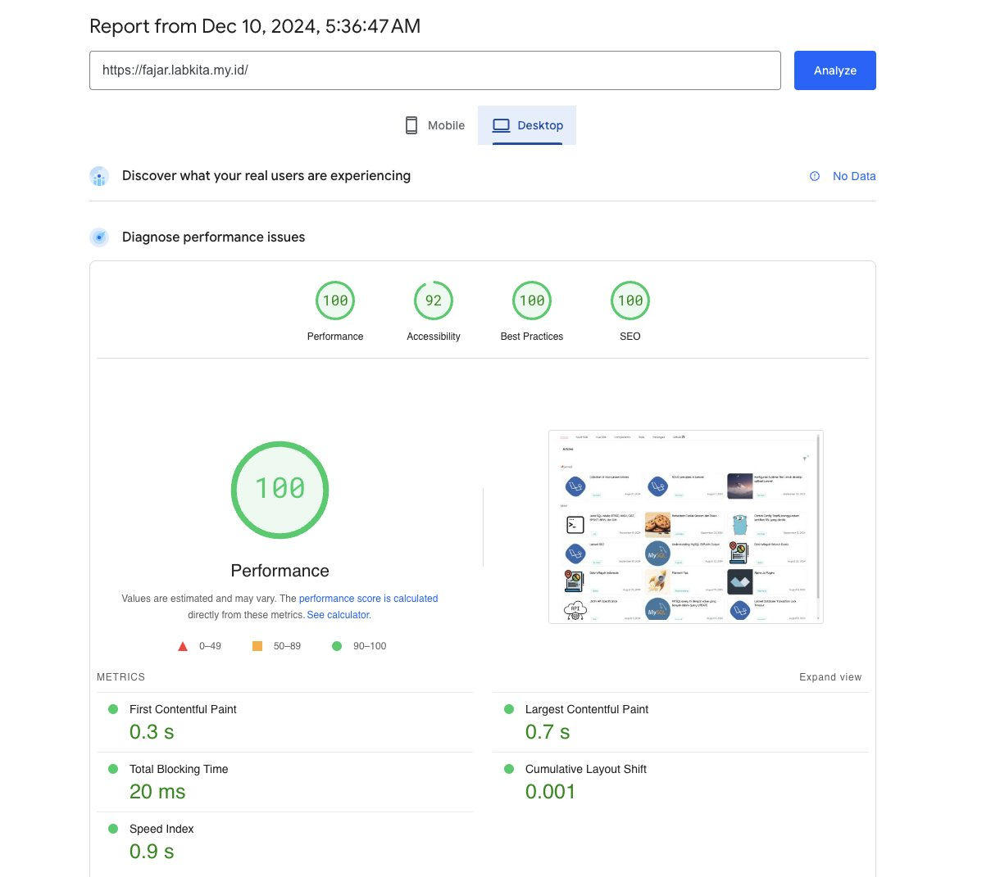

# Using Frankenphp with Laravel Octane

in your existing laravel app, install laravel octane using this command

```bash
composer require laravel/octane
php artisan octane:install --server=frankenphp
```

adjust env variable `OCTANE_SERVER=frankenphp`

to try run frankenphp, run this command:

```bash
php artisan octane:frankenphp
```

The octane:frankenphp command can take the following options:

- --host: The IP address the server should bind to (default: 127.0.0.1)
- --port: The port the server should be available on (default: 8000)
- --admin-port: The port the admin server should be available on (default: 2019)
- --workers: The number of workers that should be available to handle requests
  (default: auto)
- --max-requests: The number of requests to process before reloading the server
  (default: 500)
- --caddyfile: The path to the FrankenPHP Caddyfile file (default: stubbed
  Caddyfile in Laravel Octane)
- --https: Enable HTTPS, HTTP/2, and HTTP/3, and automatically generate and
  renew certificates
- --http-redirect: Enable HTTP to HTTPS redirection (only enabled if –https is
  passed)
- --watch: Automatically reload the server when the application is modified
- --poll: Use file system polling while watching in order to watch files over a
  network
- --log-level: Log messages at or above the specified log level, using the
  native Caddy logger

create a `Dockerfile`

i use `php 8.2` and `postgres` database so i need to install `pgsql` php
extension

```Dockerfile
FROM dunglas/frankenphp:latest-php8.2

# Install dependencies untuk Composer dan ekstensi PHP
RUN apt-get update && apt-get install -y \
    curl \
    unzip \
    libpq-dev \
    libexif-dev \
    libsodium-dev

# Install Composer
RUN curl -sS https://getcomposer.org/installer | php -- --install-dir=/usr/local/bin --filename=composer

RUN install-php-extensions \
    pgsql \
    pdo_pgsql \
    gd \
    intl \
    zip \
    exif \
    sodium \
    pcntl

WORKDIR /app

COPY . ./

# Install dependencies using Composer
RUN composer install --no-dev --optimize-autoloader

RUN rm -rf ./git

# Run FrankenPHP
ENTRYPOINT ["php", "artisan", "octane:frankenphp", "--host=0.0.0.0", "--port=80"]
```

lets build this image using

```bash
docker build -t app:latest .
```

lets create a `docker-compose.yml` file

```yaml
services:
    app:
        image: "app:latest"
        restart: unless-stopped
        entrypoint: php artisan octane:frankenphp --host=0.0.0.0 --port=80 --workers=2 --max-requests=1000
```

run it using

```bash
docker compose up -d
```

## my use case

i use frankenphp in my personal site using laravel + filament for frontend and
admin panel at [https://fajar.labkita.my.id](https://fajar.labkita.my.id), the
speed is amazing :)





## Reference

- [https://frankenphp.dev/docs/laravel/](https://frankenphp.dev/docs/laravel/)
- [https://laravel.com/docs/11.x/octane#frankenphp](https://laravel.com/docs/11.x/octane#frankenphp)
- [https://hub.docker.com/r/dunglas/frankenphp](https://hub.docker.com/r/dunglas/frankenphp)
- [https://github.com/laravel/octane/blob/2.x/src/Commands/stubs/Caddyfile](https://github.com/laravel/octane/blob/2.x/src/Commands/stubs/Caddyfile)
